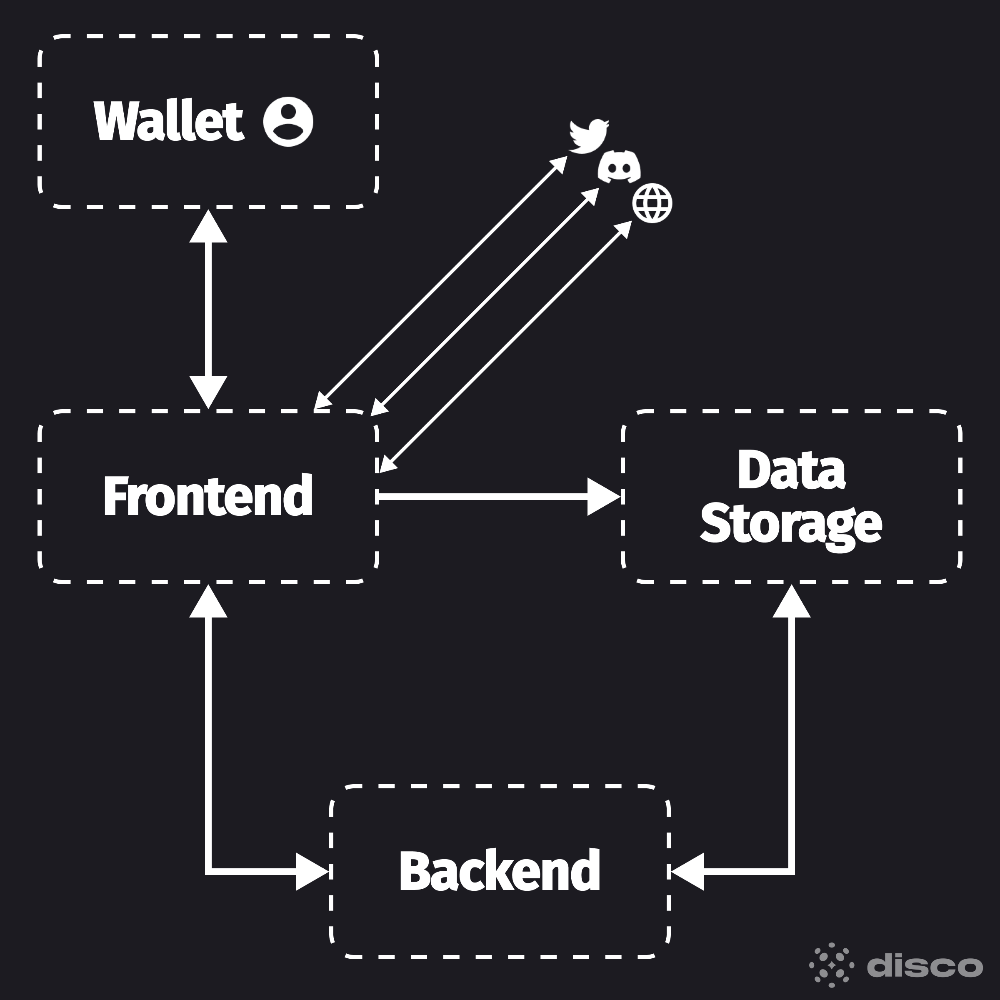

# Terminology

* **Decentralized Identifier (DID)** The Decentralized Identifiers (DIDs) is a new type of globally unique identifier designed to enable individuals and organizations to generate their own identifiers using systems they trust. DIDs enable entities to prove control over them by authenticating using cryptographic proofs such as digital signatures. A DID is a simple text string consisting of three parts:

<figure><figcaption>
Anatomy of a DID
</figcaption></figure>

* **DID Method** is the mechanism by which a particular type of DID and its associated DID document are created, resolved, updated, and deactivated. Disco supports `did:3`, `did:web` and `did:pkh.`
* **Verifiable Credential** is a tamper-evident credential that has authorship that can be cryptographically verified. The claims in a credential can be about different Subjects.
* **Credential schema** of a credential type is evaluated by the verifier according to the schema  definition and the verifier's own schema evaluation criterias.
* **Issuer** is a person or organization that have issued the Verifiable Credential.
* **Verifier** is an entity that verifies if the credential is authentic and valid. Typically, they’ll ensure that it is legitimate, tamper-proof, and is still relevant on the requested date.
* **Recipient** is a person or organization that recieved and hold the Verifiable Credential.
* **Subject** is what the claim is made about. For example, a person (the Subject) is assigned a membership. The Subject may, or may, not be the Recipient.&#x20;
* **Claim** is an assertion about a subject. For example, a person is assigned a membership (a Claim).

<figure><figcaption>
Subject and Claim
</figcaption></figure>

