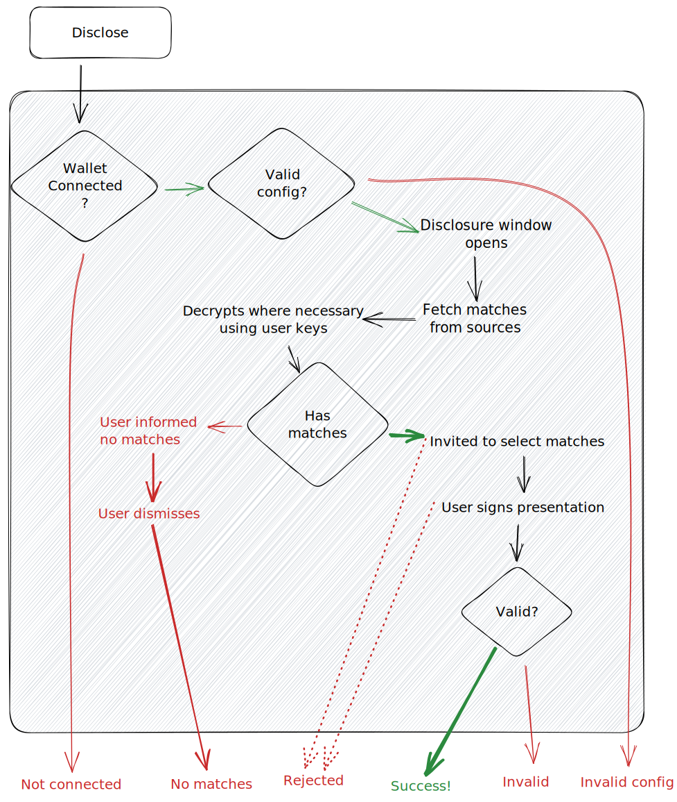

# Selective Disclosure

Selective disclosure allows you to request a credential from your users within your platform. Every disclosure requires the user to sign to verify ownership. It triggers a modal which ensures the user has a secure environment in which to select, and from which to sign & disclose, their credentials.

<figure><figcaption></figcaption></figure>
